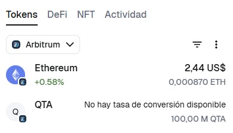

# 🌐 QUANTIA Token – Challenge 02: ($QTA)
**Solidity License Verified on Arbiscan — Arbitrum One**

[](#)
[](https://docs.soliditylang.org/)
[](https://www.gnu.org/licenses/lgpl-3.0.html)
[](https://arbiscan.io/address/0xEF14b60F45fB9118a63e3DC2AaD21B1B142554d2)
[](https://arbitrum.io/)


Languages: 🇺🇸 English (default) | 🇪🇸 Español

---

## 📌 Project Description

**GlobalBlockchain-SecAdvJourney – Challenge 02** documents the blockchain development journey of **Jorge Paez**, focused on secure smart contract engineering, advanced Solidity patterns, and industry best practices.

"QUANTIA is a next-generation Web3 development initiative focused on building secure, scalable, and decentralized DeFi infrastructure on EVM-compatible blockchains".

The project emphasizes the design and implementation of non-custodial decentralized exchange (DEX) architectures, leveraging Automated Market Maker (AMM) mechanisms, liquidity pools, and smart contract–driven token economics to enable trustless trading and decentralized liquidity.

The broader QUANTIA Ecosystem aims to provide a modular suite of protocols, standards, and tools that support:

-Secure smart contract execution.

-AMM-based liquidity and swap mechanisms.

-Tokenized ecosystems with transparent on-chain logic.

-Full user custody and decentralized control.

The approach combines cryptographic security, modular protocol design, AMM economics, and real-world usability, serving as a foundation for future DeFi applications built under the QUANTIA framework.

This repository represents an early foundational component of the QUANTIA ecosystem, focusing specifically on secure ERC20 token engineering, Solidity best practices, and professional smart contract development.

This challenger includes **QUANTIA ($QTA)** — an ERC20 token deployed and verified on **Arbitrum One**, featuring burnable functionality and a fixed supply of **100,000,000 QTA**, currently visible in MetaMask.  
This repository serves as a professional example of:

- Solidity development best practices  
- Clean and maintainable smart contract code  
- Security awareness in blockchain development  
- Transparent, verified contracts suitable for a professional portfolio  
- Educational demonstration of ERC20 token mechanics  

⚠️ **Note:** Future contract versions may implement **quantum-resistant cryptographic measures**, ensuring advanced protection against emerging threats.

---

## 📁 Included Files

```
challenge_02_QTA_Token/
├── QTA.sol               # Main ERC20 contract
├── README.md             # This file
├── LICENSE               # LGPL-3.0-only license
└── images/
    └── qta_metamask.png  # MetaMask screenshot showing 100M QTA
```

---

## 🚀 Main QTA Token Functions

| Function / Feature | Description |
|--------------------|-------------|
| `transfer`         | Standard ERC20 token transfer |
| `balanceOf`        | Check a wallet’s token balance |
| `allowance`        | Check approved delegated spending |
| `approve`          | Approve another wallet to spend tokens |
| `transferFrom`     | Transfer tokens using approved allowance |
| `burn`             | Burn own tokens (ERC20Burnable) |
| `burnFrom`         | Burn tokens from another account (ERC20Burnable) |

**Total Supply:** 100,000,000 QTA  
**Blockchain:** Arbitrum One  
**Source Code Verified:** Arbiscan  
**License:** LGPL-3.0-only

---

## 🧪 How to Use the Contract

### ✔ Compile
1. Open **Remix IDE**  
2. Create a new file: `QTA.sol`  
3. Paste the contract code  
4. Select compiler **0.8.24**  
5. Click **Compile**

### ✔ Deploy
1. In *Deploy & Run Transactions*, select:
   - Remix VM  
   - Injected Provider (MetaMask)  
   - Or another compatible network  
2. Click **Deploy**

### ✔ Interact
On **Arbiscan**, under the verified contract:

- Use **Read Contract** to check balances and allowances  
- Use **Write Contract** to transfer or burn tokens  

---

## 📷 MetaMask — QTA Token

To demonstrate the full **100,000,000 QTA** supply in my wallet, the screenshot is included below:




## 📘 Repository Vision

Future challenges and improvements may include:

- Advanced security patterns (Checks-Effects-Interactions, Reentrancy Guards)  
- Development of new ERC20 tokens with extended functionality  
- Access control and role-based designs (Ownable, Roles)  
- Upgradeable smart contracts  
- Gas optimization techniques  
- Complete dApp projects (frontend + smart contracts)  
- **Quantum-resistant implementations**  

---

## 👤 Author

**Jorge Paez**  
Blockchain Developer (Solidity – Ethereum)  
Global Expansion | Smart Contract Engineering | Security-Driven Development

---

## 📄 License

This project uses the **LGPL-3.0-only** license, consistent with all included Solidity smart contracts.

---

## 📌 Table of Contents

1. Project Description  
2. Included Files  
3. Main QTA Token Functions  
4. How to Use the Contract  
5. MetaMask – QTA Token  
6. Repository Vision  
7. Author  
8. License  

