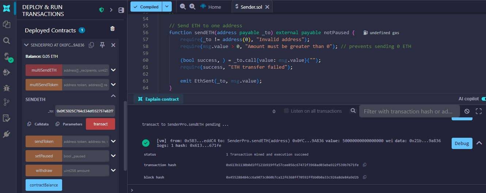
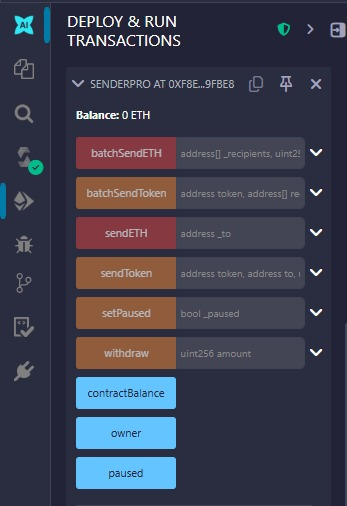
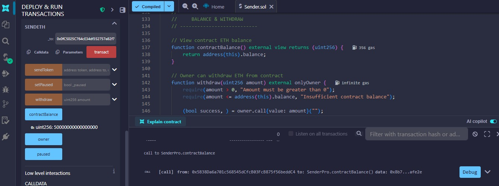
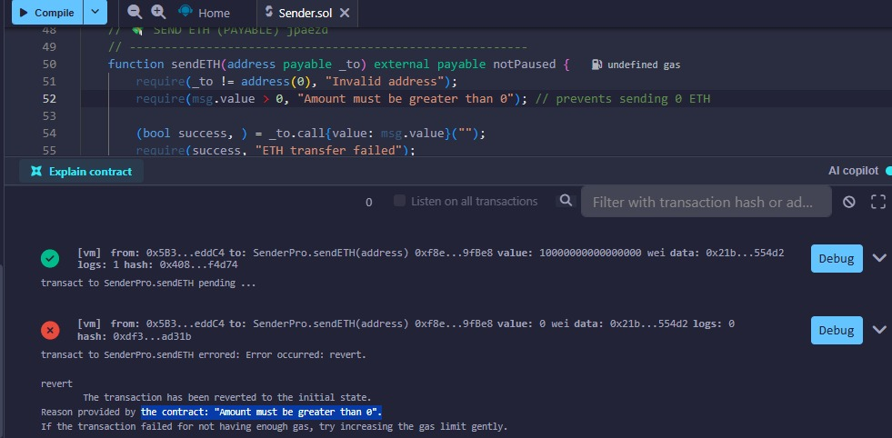
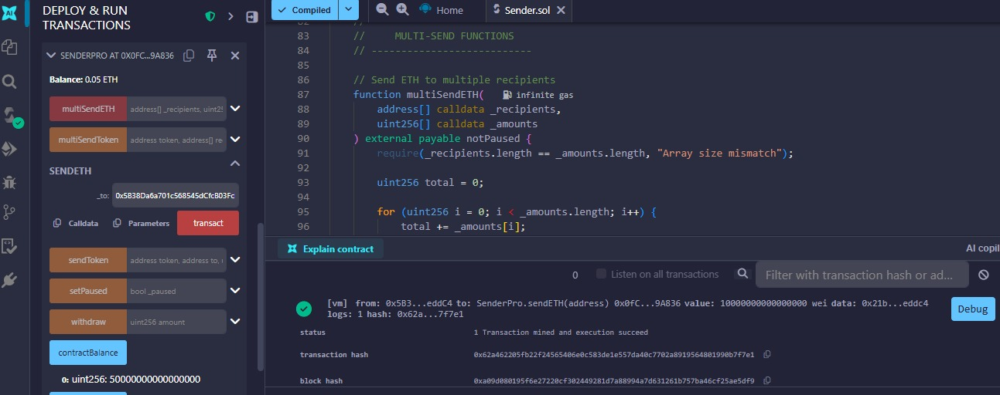
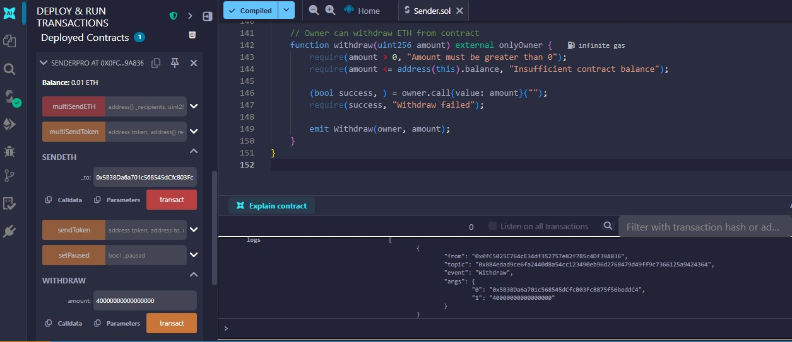

# 🌐 Challenge 03 — **Sender PRO**

Advanced **Ethereum smart contract** to send **ETH** and **ERC20 tokens** with batch support, owner control, events, and security.

---

## 🔹 Contract

**`SenderPro.sol`** — Located in `contracts/`

Includes the following features:

- 💸 **sendETH** — Payable function to send ETH to a specific address  
- 📦 **batchSendETH** — Send ETH to multiple addresses at once  
- 🪙 **sendToken** — Send ERC20 tokens to a specific address  
- 📊 **batchSendToken** — Send ERC20 tokens to multiple addresses at once  
- 🏦 **withdraw** — Owner can withdraw ETH from the contract  
- 🔍 **contractBalance** — View current ETH balance of the contract  
- 🛑 **pause / unpause** — Owner control to pause contract actions  

---

## 🔹 Captures & Explanations

### 1️⃣ Deploy
  
> Shows the contract **deployed successfully** in Remix VM.  
> No ETH sent yet (value = 0). Green highlight indicates successful compilation.

---

### 2️⃣ Functions
  
> All available functions of `SenderPro` visible: `sendETH`, `batchSendETH`, `sendToken`, `batchSendToken`, `withdraw`, `contractBalance`, `setPaused`.  
> Confirms contract is fully functional after deployment.

---

### 3️⃣ Balance
  
> Checks **contractBalance()** after sending ETH.  
> Shows **current ETH stored in contract** (in wei).  
> Demonstrates ability to track funds before withdrawal.

---

### 4️⃣ Revert
  
> Triggered by calling `sendETH` with **0 ETH**.  
> Shows **require statement working**:  
> `Amount must be greater than 0`  
> Proof of proper validation and security.

---

### 5️⃣ SendETH
  
> Sending **0.01 ETH** (or 0.05 ETH) to a recipient address.  
> Shows successful transaction, green status in Remix, and log event `EthSent`.  
> Demonstrates **payable function in action**.

---

### 6️⃣ Withdraw
  
> Owner withdraws ETH from contract.  
> Log event `Withdraw` confirms amount and owner address.  
> Shows **ownership control** and **fund security** in practice.

---

## 🔹 Notes & Features

- ✅ **Payable functions** tested in Remix VM  
- ✅ **Event logs** verified for ETH and token transfers  
- ✅ **Ownership control** implemented with `onlyOwner` modifier  
- ✅ **Security checks**: prevent 0 ETH transfers, invalid addresses  
- ✅ **Batch sending** for ETH and ERC20 tokens  
- 🔹 Ready for educational demonstrations or advanced testing  

---

### 🔹 Tips for Students

- Always check `contractBalance()` before and after transactions  
- Use logs from Remix to verify **events emitted**  
- Play with `paused` state to test **pause/unpause functionality**  

---

