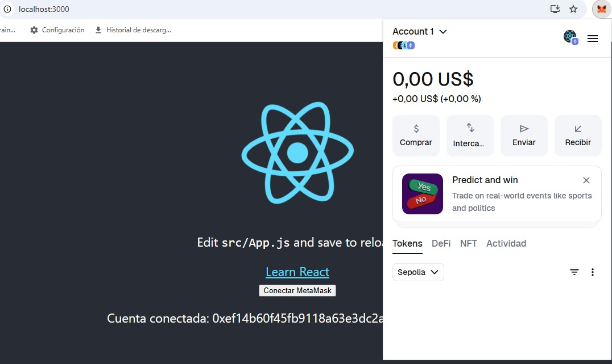

# 🌐 Challenge 04 – **React + MetaMask Wallet Connector**

[](#)
[](https://reactjs.org/)
[](https://www.typescriptlang.org/)
[](https://opensource.org/licenses/MIT)
[](https://ethereum.org/)


---

## 📌 Description

This challenge implements a **Wallet Connector** in React + TypeScript to interact with MetaMask. It shows the connected account, active network, and balances in **ETH** and **QTA token**. It is divided into **Basic** and **PRO Version** to demonstrate advanced functionalities and real-time balance display.

---

## 🟢 Basic Version

- Simple MetaMask connection.
- Shows the connected account and network.
- Built using React functional components and hooks.

**Screenshot:**



---

## 🚀 PRO Version

### PRO Features

- Advanced MetaMask connection.
- Real-time balances in ETH and QTA.
- Network verification and error messages for incorrect network.
- Visual status when wallet is connected.

### PRO Screenshots

**1️⃣ Wallet connecting (initial connection):**  


**2️⃣ Wallet connected and balances loaded:**  


### Example Code for Connection & Balances

```tsx
import React, { useState, useEffect } from "react";
import { ethers } from "ethers";

declare const window: Window & { ethereum?: any };

function WalletConnectorPro() {
  const [account, setAccount] = useState<string>("");
  const [ethBalance, setEthBalance] = useState<string>("");
  const [qtaBalance, setQtaBalance] = useState<string>("");

  const connectWallet = async () => {
    if (!window.ethereum) {
      alert("MetaMask is not installed.");
      return;
    }
    const [selectedAccount] = await window.ethereum.request({ method: "eth_requestAccounts" });
    setAccount(selectedAccount);
    await getBalances(selectedAccount);
  };

  const getBalances = async (account: string) => {
    const provider = new ethers.BrowserProvider(window.ethereum);
    const eth = await provider.getBalance(account);
    setEthBalance(ethers.formatEther(eth));

    // QTA token contract
    const QTA_ADDRESS = "0xYOUR_QTA_ADDRESS"; 
    const QTA_ABI = ["function balanceOf(address) view returns (uint256)"];
    const qtaContract = new ethers.Contract(QTA_ADDRESS, QTA_ABI, provider);
    const qta = await qtaContract.balanceOf(account);
    setQtaBalance(ethers.formatUnits(qta, 18));
  };

  useEffect(() => {
    if (window.ethereum) {
      window.ethereum.on("accountsChanged", ([newAccount]) => {
        setAccount(newAccount || "");
        if (newAccount) getBalances(newAccount);
      });
      window.ethereum.on("chainChanged", () => window.location.reload());
    }
  }, []);

  return (
    <div>
      <button onClick={connectWallet}>Connect Wallet</button>
      {account && (
        <div>
          <p>Account: {account}</p>
          <p>ETH: {ethBalance || "Loading..."}</p>
          <p>QTA: {qtaBalance || "Loading..."}</p>
        </div>
      )}
    </div>
  );
}

export default WalletConnectorPro;

