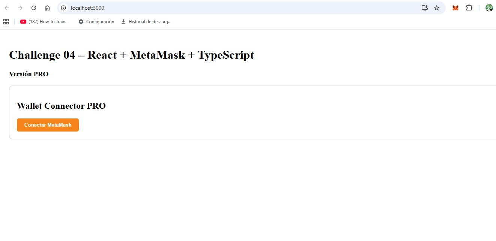
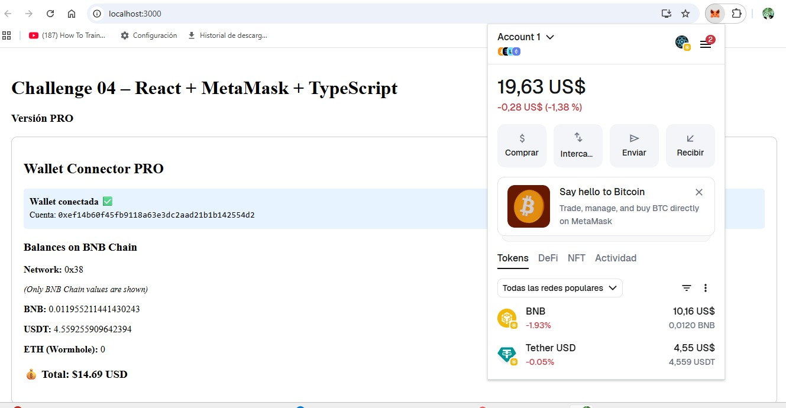
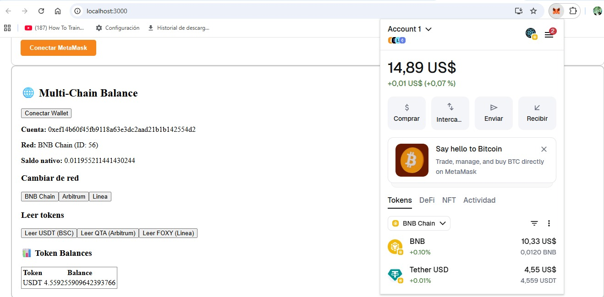
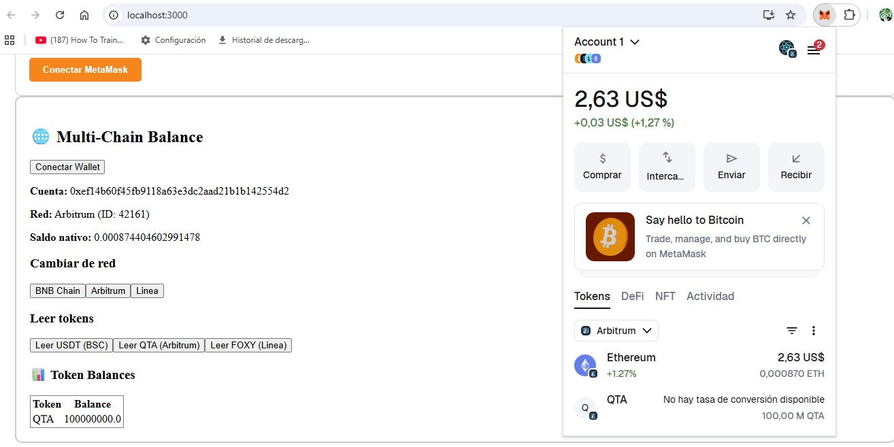
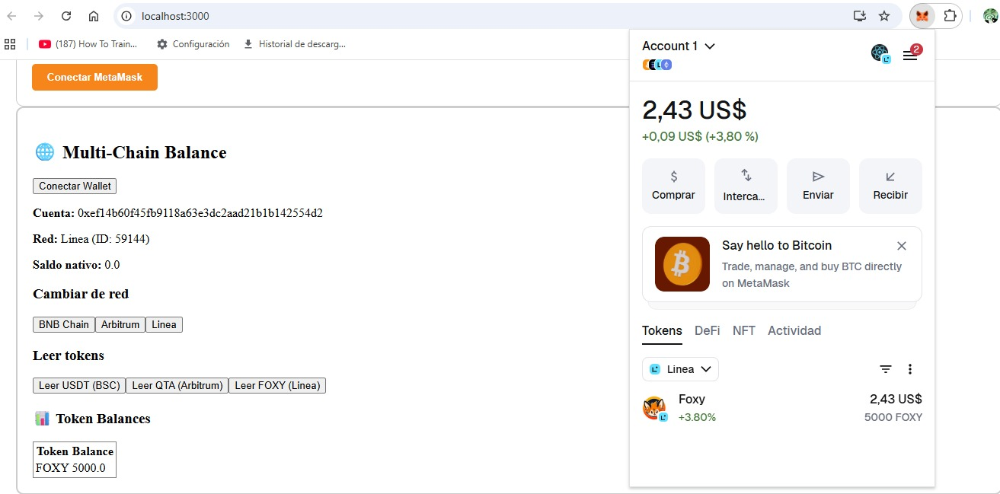
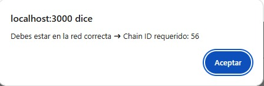

```
Challenge_04_React_TypeScript_Wallet_Connector/pro/Challenger_04_pro/README.md
```

---

````markdown
# Challenge 04 – PRO Version


This folder contains the **PRO implementation of the Web3 wallet integration** using React and TypeScript. It demonstrates a production-ready setup with modular components, real-time balance updates, and multichain support.

---

## Contents

- `WalletConnectorPro1.tsx` – Connect wallet and show initial UI  
- `WalletConnectorPro2.tsx` – Wallet connected state with balances loaded  
- `multichain/` – Components for handling **BNB Chain, Arbitrum, and Linea** networks:
  - `balanceMultiChain.tsx` – Display token balances per chain  
  - `networkSwitcher.ts` – Switch and detect networks  
  - `tokenReader.ts` – Read token balances safely with network checks

---

## Usage

1. Navigate to this folder in the terminal.  
2. Install dependencies:

```bash
npm install
````

3. Start the project:

```bash
npm start
```

4. Open the browser and click **Connect MetaMask**.
5. Switch networks in MetaMask to see balances on different chains.
6. Alerts will appear if you attempt to check a token on the wrong chain.

---

## Screenshots

**1️⃣ Wallet Connector PRO 1**


**2️⃣ Wallet Connector PRO 2**


**3️⃣ BNB Chain**


**4️⃣ Arbitrum**


**5️⃣ Linea**


**6️⃣ Alert when querying a token on the wrong network**


> Note: To see correct token balances, make sure you are on the corresponding network in MetaMask.

---

## Notes

* All components are **modular** and ready for reuse.
* This folder demonstrates **multichain handling and safety alerts** for production-ready frontends.

```
