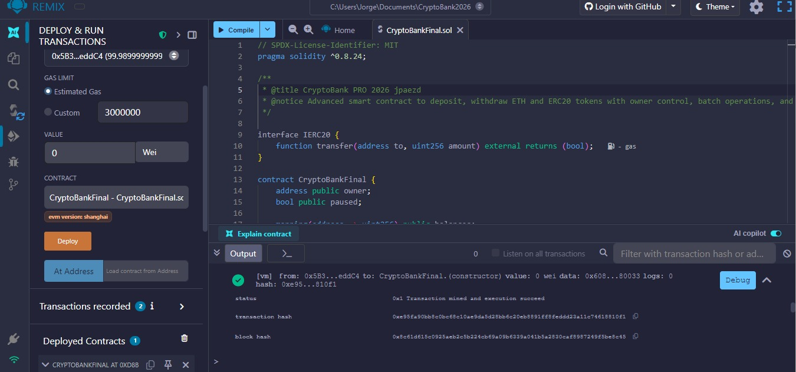
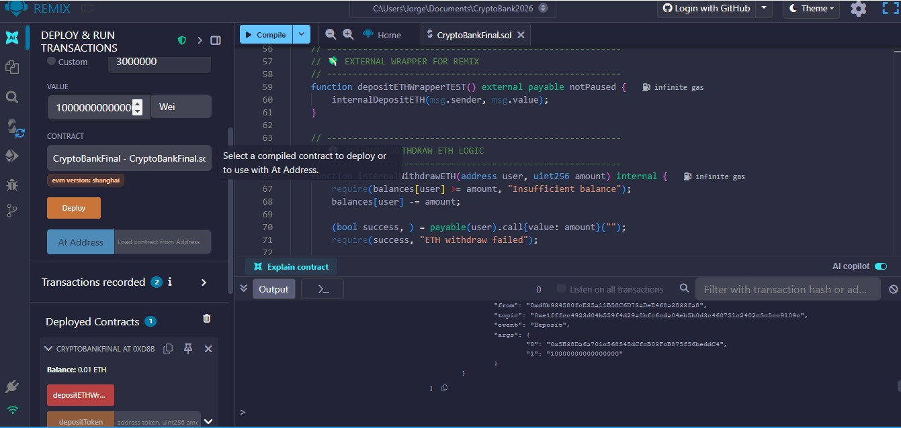
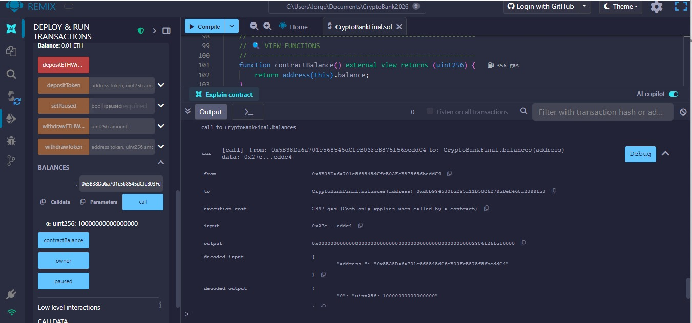
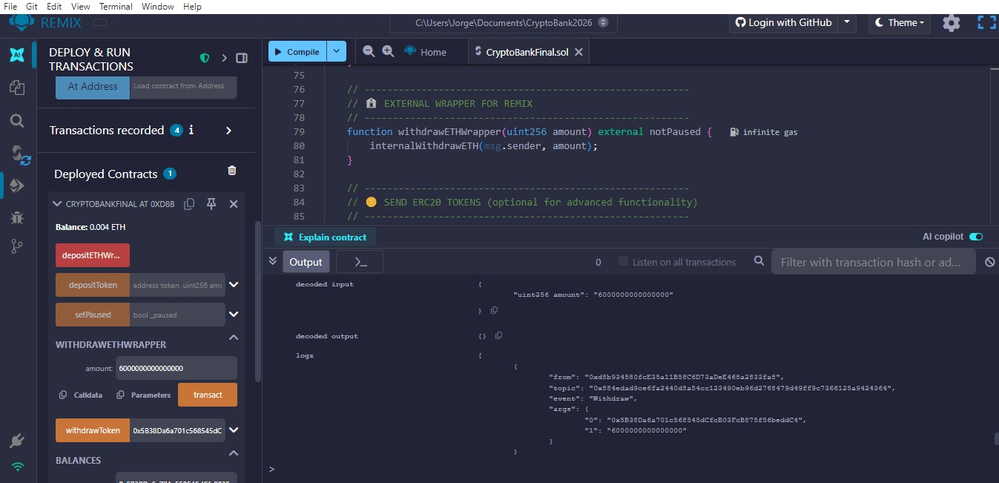
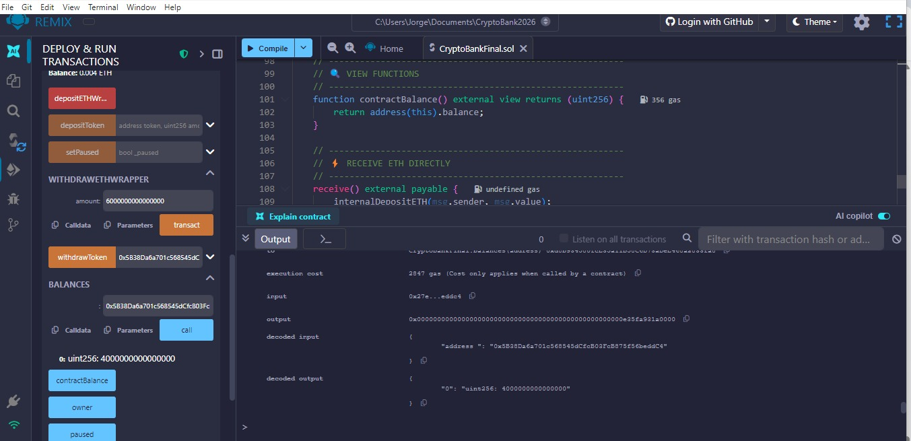
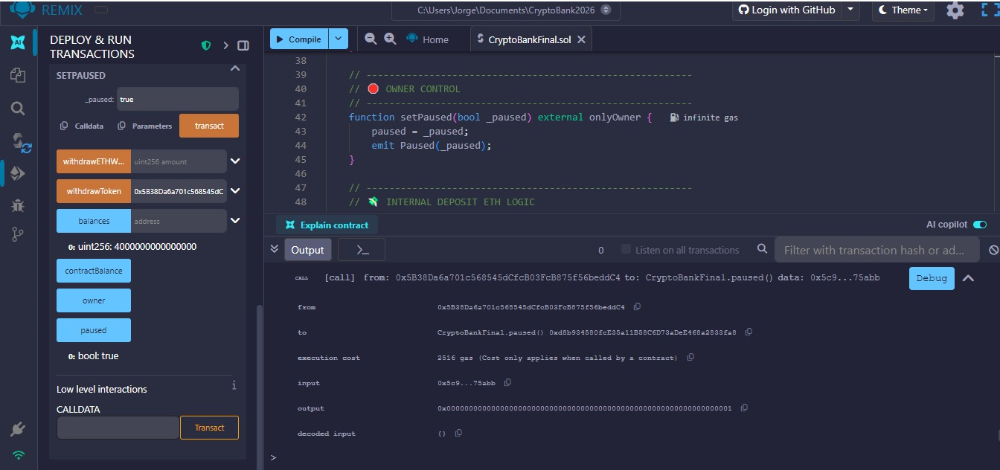

# 🌐 Challenge 05 – **CryptoBank PRO 2026**

**Description:**
CryptoBank PRO is an **advanced smart contract** that allows depositing and withdrawing ETH, interacting with ERC20 tokens, and managing the contract with **owner control** and **pause functionality** (`paused`). Every action triggers **events** to audit activity.

---

## 🖼 Step-by-Step Screenshots

<!-- Deploy -->

<h3>Deploy</h3>

Contract deployed and owner assigned.

<!-- Deposit -->

<h3>Deposit ETH</h3>

Executed <code>depositETHWrapperTEST()</code>. <code>Deposit</code> event confirmed.

<!-- Balance -->

<h3>Balance</h3>

Check user balance after deposit.

<!-- Withdraw -->

<h3>Partial Withdrawal</h3>

Withdraws 60% of the user’s balance. <code>Withdraw</code> event confirmed.

<!-- New Balance -->

<h3>New Balance</h3>

Remaining balance verified after partial withdrawal.

<!-- Paused -->

<h3>Pause Contract</h3>

Owner pauses the contract. Deposits and withdrawals are blocked.

---

## 💻 Contract Features

* **Owner Control:** Only the owner can pause or resume the contract.
* **Pause Functionality:** Stop the contract in case of emergency.
* **Deposit / Withdraw ETH:** Deposit and withdraw ETH, fully or partially.
* **Deposit / Withdraw ERC20 Tokens:** Send and receive ERC20 tokens.
* **External Wrappers:** <code>depositETHWrapperTEST()</code> and <code>withdrawETHWrapper()</code> allow testing in Remix without touching internal logic.
* **Events:** <code>Deposit</code>, <code>Withdraw</code>, <code>TokenDeposit</code>, <code>TokenWithdraw</code>, <code>Paused</code> for auditing all activities.

---

## ⚡ How to Use in Remix

1. Open `CryptoBankFinal.sol` in Remix.
2. Compile with **Solidity 0.8.24+** and EVM version `Cancun` or `London`.
3. Deploy the contract from the account that will become the `owner`.
4. Use external wrappers to test deposits and withdrawals.
5. Check **Logs/Events** to audit each action.

---

## ✅ Conclusion

CryptoBank PRO 2026 is a **secure, professional, and test-ready contract**, ideal for:

* Learning to handle deposits and withdrawals of ETH and ERC20 tokens.
* Practicing access control (`owner`) and contract pausing.
* Generating events to audit transactions.
* Integrating with future DApps or external interfaces.

---

