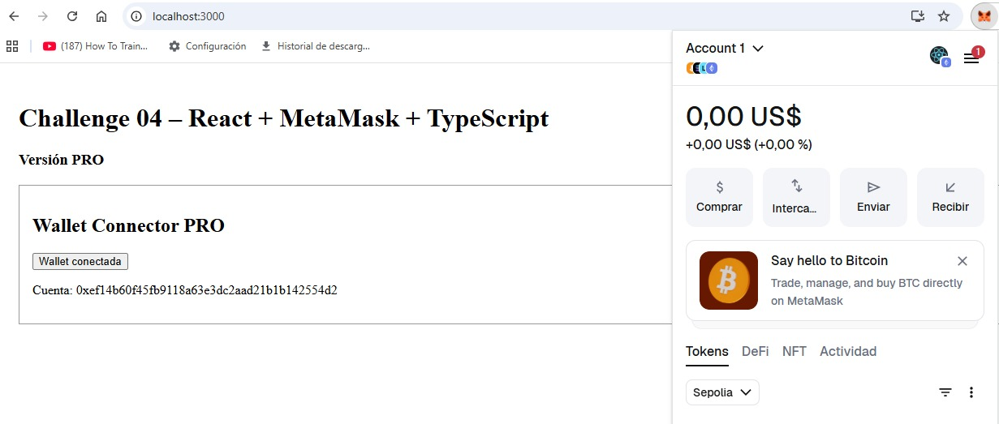

# Challenge 04 – React + MetaMask + TypeScript

[] 
[]
[]
[]

This repository showcases my **progressive Web3 development journey**, specifically the evolution of a **wallet connection using React and TypeScript** with MetaMask.  

I structured the project in **two stages**:

- **Basic version** – Fundamental MetaMask connection, beginner-friendly.  
- **PRO version** – Production-ready wallet integration with lifecycle handling, safety checks, and advanced architecture.

Each stage is documented separately to highlight my **technical growth** and **best practices in Web3 frontends**.

---

## 📂 Project Structure

```

/basic → Beginner-friendly implementation
/pro   → Advanced, production-oriented implementation
/src   → Source code (React + TypeScript)
/public → Public assets

```

---

## 🛠 Tech Stack

- **React**
- **TypeScript**
- **MetaMask (EIP-1193)**
- **Web3 fundamentals**

---

## 🎯 Goal

Demonstrate **progressive Web3 frontend skills** in a recruiter-friendly format, showing both **basic implementation** and **advanced production-ready solutions**.

---

## 📸 Screenshots

**PRO Version – Wallet Connector:**

[](pro/WalletConnectorPro.png)

Click the image to open the full screenshot.

---

## ✅ Notes

- `/basic` folder: contains the initial simple wallet connection.  
- `/pro` folder: contains the advanced WalletConnectorPro implementation.  
- This README serves as the **main entry point**, with overview and links to both versions.  


